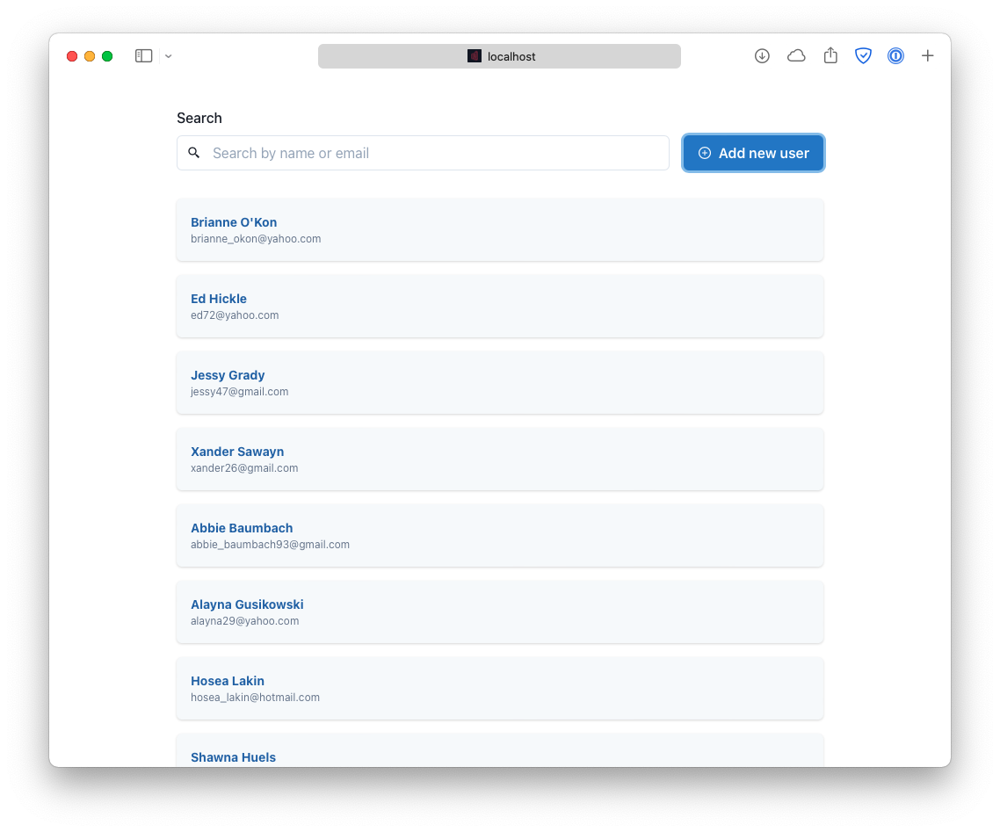

# Redis crud

A simple crud with Next, Redis and real time search.



## Running Locally

```bash
docker-compose up -d
yarn && yarn seed && yarn dev
```

## Built Using

- [Next.js](https://nextjs.org)
- [Redis OM Node.js](https://github.com/redis/redis-om-node)
- [Chakra UI](https://chakra-ui.com)
- [TypeScript](https://www.typescriptlang.org)
